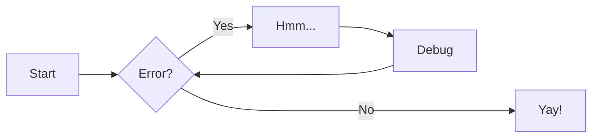

# Testi

## Yleistä

<figure markdown="span">
  { width="300" loading=lazy}
  <figcaption>Image caption</figcaption>
</figure>

-   [x] Lorem ipsum dolor sit amet, consectetur adipiscing elit
-   [ ] Vestibulum convallis sit amet nisi a tincidunt
    -   [x] In hac habitasse platea dictumst
    -   [x] In scelerisque nibh non dolor mollis congue sed et metus
    -   [ ] Praesent sed risus massa
-   [ ] Aenean pretium efficitur erat, donec pharetra, ligula non scelerisque

The HTML specification is maintained by the W3C.

*[HTML]: Hyper Text Markup Language*
*[W3C]: World Wide Web Consortium*

=== "C"

    ``` c
    #include <stdio.h>

    int main(void) {
      printf("Hello world!\n");
      return 0;
    }
    ```

=== "C++"

    ``` c++
    #include <iostream>

    int main(void) {
      std::cout << "Hello world!" << std::endl;
      return 0;
    }
    ```



!!! danger

    Lorem ipsum dolor sit amet, consectetur adipiscing elit. Nulla et euismod
    nulla. Curabitur feugiat, tortor non consequat finibus, justo purus auctor
    massa, nec semper lorem quam in massa.

!!! note annotate "Phasellus posuere in sem ut cursus (1)"

    Lorem ipsum dolor sit amet, (2) consectetur adipiscing elit. Nulla et
    euismod nulla. Curabitur feugiat, tortor non consequat finibus, justo
    purus auctor massa, nec semper lorem quam in massa.

1.  :man_raising_hand: I'm an annotation!
2.  :woman_raising_hand: I'm an annotation as well!
