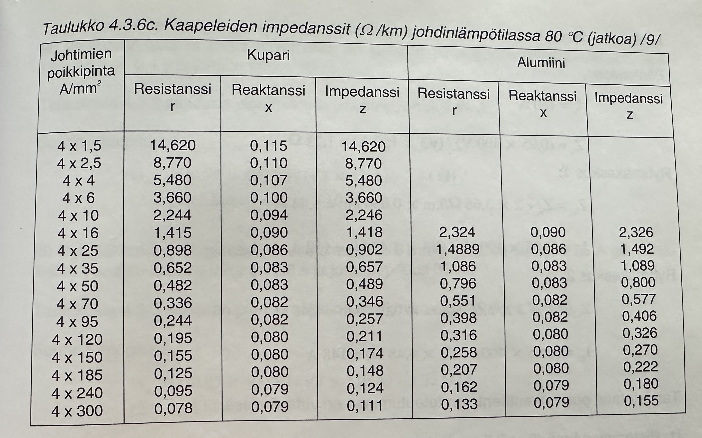
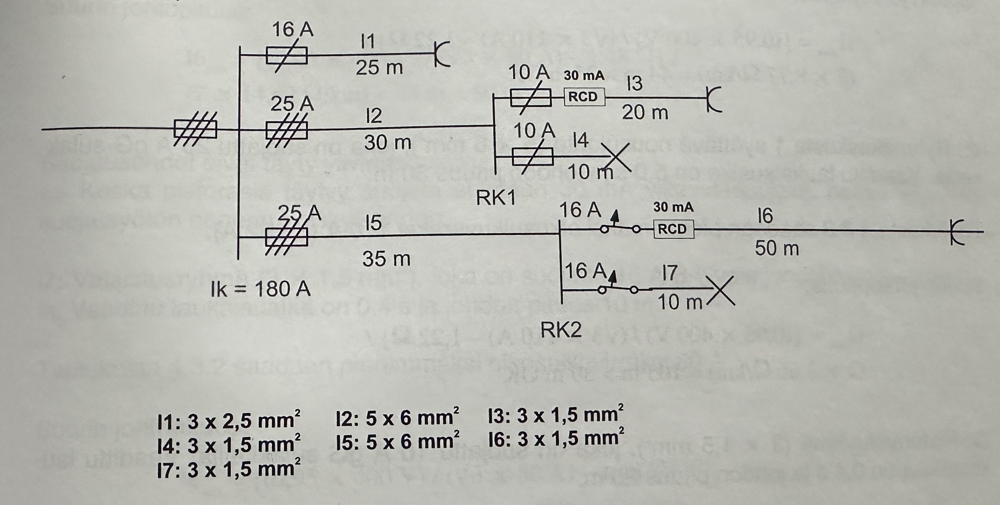
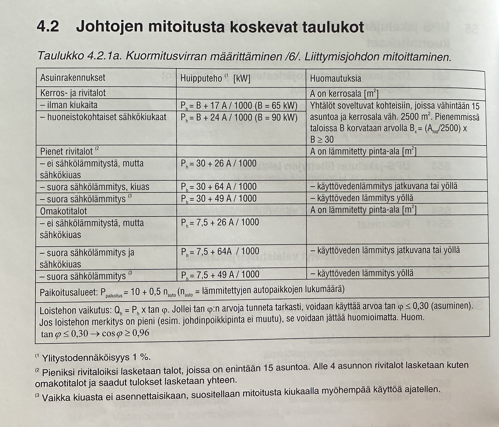

# Sähköasennusten mitoitus

## Oikosulkuvirtojen laskeminen

<figure markdown="span">
  { width="600" loading=lazy}
  <figcaption>Kaapeleiden impedanssit [1]</figcaption>
</figure>

<figure markdown="span">
  { width="600" loading=lazy}
  <figcaption>Oikosulkuvirta esimerkki [1]</figcaption>
</figure>

### Pääkeskus

$$
I{\text{k}} = 180A
$$

$$
Z{\text{v}} = \frac{cos \phi \cdot U}{\sqrt{3} \cdot I{\text{k}}}
$$

$$
Z{\text{v}} = \frac{0,95 \cdot 400V}{\sqrt{3} \cdot 180A} = 1,22\Omega
$$

### Ryhmäkeskus 1

$$
Z{\text{v1}} = Z{\text{v}} + 2 \cdot 3,66 \frac{\Omega}{km} \cdot 0,030km = 1,44\Omega
$$

!!! note

    Kaavan Zv saadaan pääkeskuksen lasketusta verkon impedanssista.

$$
I{\text{k1}} = \frac{0,95 \cdot 400V}{\sqrt{3} \cdot 1,44\Omega} = 152A
$$

### Ryhmäkeskus 2

$$
Z{\text{v2}} = Z{\text{v}} + 2 \cdot 3,66 \frac{\Omega}{km} \cdot 0,035km = 1,48\Omega
$$

$$
I{\text{k1}} = \frac{0,95 \cdot 400V}{\sqrt{3} \cdot 1,48\Omega} = 148A
$$

## Liittymistehon mitoitus

### Kuormitustehon määrittäminen

<figure markdown="span">
  { width="600" loading=lazy}
  <figcaption>Liittymisjohdon mitoittaminen</figcaption>
</figure>

Omakotitalot ja pienet rivitalot, joissa ei ole (ylempi) tai on suora sähkölämmitys sekä sähkökiuas, lausekkeessa \(A\_{\text{lämm}}\) on lämmitykseen mitetty pinta-ala:

$$
P{\text{max}} = P{\text{va}} + 26 \cdot \frac{A{\text{lämm}}}{1000}, \quad P{\text{va}} = 7.5 \, \text{kW}
$$

Nykyaikaisissa passiivititaloissa riittää 64 W/m² sijoitettu pinta-ala, joissa ei ole tai on suora sähkölämmitys sekä sähkökiuas, lausekkeessa \(A\_{\text{lämm}}\) on lämmitykseen mitetty pinta-ala:

$$
P{\text{max}} = P{\text{va}} + 26 \cdot \frac{A{\text{lämm}}}{1000}, \quad P{\text{va}} = 30 \, \text{kW}
$$

$$
P{\text{max}} = P{\text{va}} + 64 \cdot \frac{A{\text{lämm}}}{1000}, \quad P{\text{va}} = 30 \, \text{kW}
$$

Kerros- ja rivitalot ilman kiukaita ja huoneistokohtaisesti lämmityksestä vastaavat, lausekkeessa \(A\_{\text{kr}}\) on kerrospinta-ala:

$$
P{\text{max}} = P{\text{va}} + 26 \cdot \frac{A{\text{kr}}}{1000}, \quad P{\text{va}} = \text{määritelty arvo}
$$

### Sallitut kuormitusvirrat

| gG-tyypin sulakkeen suurin sallittu nimellisvirta | Johdon sallittu kuormitus vähintään [A] |
| :-----------------------------------------------: | :-------------------------------------: |
|                         6                         |                    8                    |
|                        10                         |                  13,5                   |
|                        16                         |                   18                    |
|                        20                         |                   22                    |
|                        25                         |                   28                    |
|                        32                         |                   35                    |
|                        35                         |                   39                    |
|                        40                         |                   44                    |
|                        50                         |                   55                    |
|                        63                         |                   70                    |
|                        80                         |                   88                    |
|                        100                        |                   110                   |
|                        125                        |                   138                   |
|                        160                        |                   177                   |
|                        200                        |                   221                   |
|                        250                        |                   276                   |
|                        315                        |                   348                   |
|                        400                        |                   441                   |
|                        500                        |                   552                   |
|                        630                        |                   695                   |
|                        800                        |                   883                   |
|                       1000                        |                  1103                   |
|                       1250                        |                  1379                   |

## Lähteet

1. Sähkötieto RY. 2010. Sähköteknisiä taulukoita ST-Käsikirja nro. 30. s. 83. ISBN 978-952-231-013-2.
