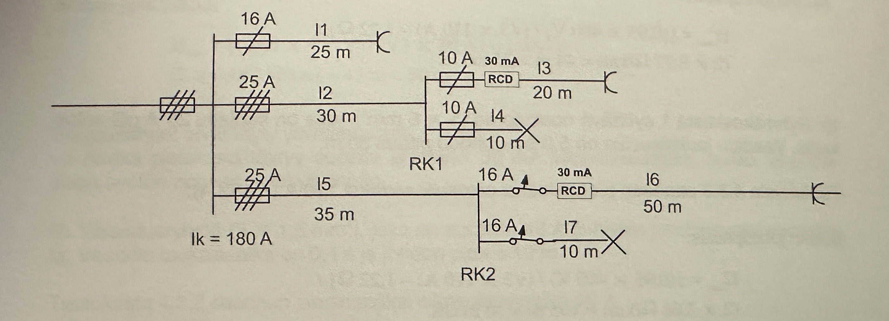

# Sähköasennusten mitoitus

## Perus käsitteet

| Symbol | Description         |
| ------ | ------------------- |
| U      | Jännite (V)         |
| I      | Virta (A)           |
| P      | Teho (W)            |
| S      | Näennäisteho (VA)   |
| Q      | Reaktiiviteho (VAR) |
| cos φ  | Tehokerroin         |
| f      | Taajuus (Hz)        |
| t      | Aika (s)            |
| R      | Vastus (Ω)          |
| L      | Induktanssi (H)     |
| C      | Kapasitanssi (F)    |
| X      | Reaktanssi (Ω)      |
| Z      | Impedanssi (Ω)      |
| Y      | Admittanssi (S)     |

## Pääsulakkeen mitoitus

## Jakokeskuksen mitoitus

## Johdotuksen mitoitus

## Valaisimien mitoitus

## Pistorasioiden mitoitus

## Oikosulkuvirtojen laskeminen

Pääkeskus

$$
I{\text{k}} = 180A
$$

$$
Z{\text{v}} = \frac{0,95 \cdot 400V}{\sqrt{3} \cdot 180A} = 1,22\Omega
$$

Ryhmäkeskus 1

$$
Z{\text{v1}} = Z{\text{v}} + 2 \cdot 3,66 \frac{\Omega}{km} \cdot 0,030km = 1,44\Omega
$$

$$
I{\text{k1}} = \frac{0,95 \cdot 400V}{\sqrt{3} \cdot 1,44\Omega} = 152A
$$

Ryhmäkeskus 2

$$
Z{\text{v2}} = Z{\text{v}} + 2 \cdot 3,66 \frac{\Omega}{km} \cdot 0,035km = 1,48\Omega
$$

$$
I{\text{k1}} = \frac{0,95 \cdot 400V}{\sqrt{3} \cdot 1,48\Omega} = 148A
$$

## Lämmityksen mitoitus

## Ilmanvaihdon mitoitus

## Lämpöpumppujen mitoitus

## Aurinkopaneelien mitoitus

## Lämpökaapeleiden mitoitus

## Kaapelin mitoitus

## Sulake- ja katkaisijasuojauksen mitoitus

## Liittymistehon mitoitus

Omakotitalot ja pienet rivitalot, joissa ei ole (ylempi) tai on suora sähkölämmitys sekä sähkökiuas, lausekkeessa \(A\_{\text{lämm}}\) on lämmitykseen mitetty pinta-ala:

$$
P{\text{max}} = P{\text{va}} + 26 \cdot \frac{A{\text{lämm}}}{1000}, \quad P{\text{va}} = 7.5 \, \text{kW}
$$

Nykyaikaisissa passiivititaloissa riittää 64 W/m² sijoitettu pinta-ala, joissa ei ole tai on suora sähkölämmitys sekä sähkökiuas, lausekkeessa \(A\_{\text{lämm}}\) on lämmitykseen mitetty pinta-ala:

$$
P{\text{max}} = P{\text{va}} + 26 \cdot \frac{A{\text{lämm}}}{1000}, \quad P{\text{va}} = 30 \, \text{kW}
$$

$$
P{\text{max}} = P{\text{va}} + 64 \cdot \frac{A{\text{lämm}}}{1000}, \quad P{\text{va}} = 30 \, \text{kW}
$$

Kerros- ja rivitalot ilman kiukaita ja huoneistokohtaisesti lämmityksestä vastaavat, lausekkeessa \(A\_{\text{kr}}\) on kerrospinta-ala:

$$
P{\text{max}} = P{\text{va}} + 26 \cdot \frac{A*{\text{kr}}}{1000}, \quad P{\text{va}} = \text{määritelty arvo}
$$
